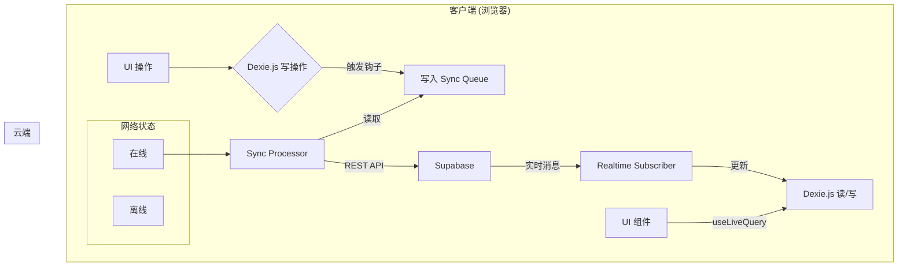

# 单词卡片应用 (WordCard)

WordCard 是一款使用现代 Web 技术构建的、功能强大的单词卡片记忆应用。它旨在通过间隔重复系统 (SRS) 帮助用户高效地学习和记忆单词。

## ✨ 核心特性

- **本地优先 (Local-First) 架构**: 极致的响应速度和完整的离线使用能力。所有操作都在本地即时完成，无需等待网络。
- **云端同步**: 支持多设备间的数据同步。在一个设备上学习，进度会自动同步到其他设备。
- **智能复习**: 内置简化的 FSRS 算法，根据您的记忆曲线智能安排下一次复习时间。
- **完整的词库管理**: 支持单词的增、删、改、查，以及高效的批量操作。
- **数据统计**: 提供可视化的数据总览和掌握程度分布图表。
- **用户系统**: 集成 Supabase Auth，支持安全的邮箱/密码注册和登录。

## 🚀 技术栈

- **框架**: [Next.js](https://nextjs.org/) 15 (App Router)
- **UI**: [React](https://react.dev/) 19 + [Tailwind CSS](https://tailwindcss.com/) v4
- **组件库**: [Shadcn UI](https://ui.shadcn.com/)
- **后端服务 (BaaS)**: [Supabase](https://supabase.com/) (认证, PostgreSQL 数据库, 实时订阅)
- **客户端数据库**: [Dexie.js](https://dexie.org/) (IndexedDB 封装)
- **状态管理**: [Zustand](https://zustand-demo.pmnd.rs/)
- **验证**: [Zod](https://zod.dev/)

## 🏗️ 架构亮点

本项目采用**本地优先 (Local-First)** 架构。



所有的数据操作首先在本地的 `Dexie.js` (IndexedDB) 中进行，实现了零延迟的用户体验。然后，一个后台同步服务会将这些变更通过一个可靠的“同步队列”推送至云端的 `Supabase` 数据库，并能通过实时订阅接收来自其他设备的变更。

## 🛠️ 本地开发

1.  **克隆仓库**
    ```bash
    git clone <your-repository-url>
    cd wordcard
    ```

2.  **安装依赖**
    ```bash
    pnpm install
    ```

3.  **配置环境变量**
    - 复制 `.env.local.example` (如果不存在，请创建一个) 为 `.env.local`。
    - 在文件中填入您的 Supabase 项目 URL 和 Anon Key。
    ```env
    NEXT_PUBLIC_SUPABASE_URL=your-supabase-url
    NEXT_PUBLIC_SUPABASE_ANON_KEY=your-supabase-anon-key
    ```

4.  **运行开发服务器**
    ```bash
    pnpm run dev
    ```

5.  在浏览器中打开 `http://localhost:3000`。
